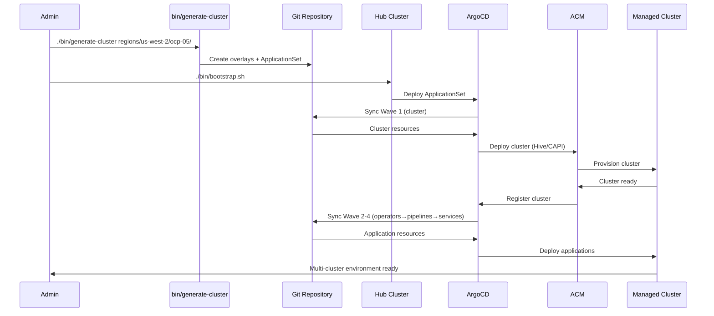

# OpenShift Bootstrap

**GitOps-driven multi-cluster management for OpenShift and EKS.** Deploy and manage regional clusters at scale using a centralized hub cluster approach.

This repository provides a complete automation framework for:
- **Cluster provisioning** - OpenShift (via Hive) and EKS (via CAPI) clusters across multiple AWS regions
- **GitOps automation** - ArgoCD ApplicationSets orchestrate deployments with proper dependency ordering  
- **Operations at scale** - Advanced Cluster Management (ACM) provides unified cluster lifecycle management
- **Pipeline automation** - Tekton pipelines deploy consistently across all managed clusters
- **Service deployment** - OCM database services and applications deploy automatically to target clusters

**Key benefits:** Single command cluster creation, automatic GitOps integration, semantic directory organization for intuitive navigation, and support for hybrid OpenShift/EKS environments.

## 🏗️ Architecture Overview

**Hub-Spoke Model**: One OpenShift hub cluster manages multiple regional clusters (OpenShift or EKS) using GitOps automation.

- **Hub Cluster**: Runs ArgoCD, ACM, and all cluster management operators
- **Managed Clusters**: Regional OpenShift (OCP) or EKS clusters provisioned and managed automatically
- **Automated Provisioning**: Single command creates complete cluster overlays with proper GitOps integration

## 📁 Directory Structure & Navigation

The repository uses **semantic directory organization** designed for intuitive navigation. Each directory level follows consistent patterns that clearly indicate purpose and scope.

### 🔍 Semantic Organization Patterns

**Top-level directories represent "things":**
- `clusters/` - Cluster provisioning configurations
- `operators/` - Application/operator deployments  
- `pipelines/` - Pipeline configurations
- `deployments/` - Service deployments
- `regions/` - Regional cluster specifications
- `bases/` - Reusable template components

**Nested patterns follow logical hierarchy:**
- **operators/{operator-name}/{deployment-target}/** - Service-first, then location
- **pipelines/{pipeline-name}/{cluster-name}/** - Pipeline type, then target cluster  
- **deployments/{service-name}/{cluster-name}/** - Service type, then deployment location
- **regions/{aws-region}/{cluster-name}/** - Geographic organization

**Deployment targets are consistent:**
- `global/` - Hub cluster deployments (shared infrastructure)
- `{cluster-name}/` - Managed cluster-specific deployments (e.g., `ocp-02/`, `eks-01/`)

The repository is designed for **intuitive navigation** with each directory level showing your next options:

### 🔧 Generation Input (where you start)
```bash
regions/                          # Available AWS regions
├── us-east-1/                   # Region-specific clusters
│   ├── ocp-02/              # Individual cluster specifications
│   │   └── region.yaml          # ← START HERE: cluster configuration
│   └── ocp-03/
└── us-west-2/
    └── eks-02/
```

### 🏭 Base Templates (shared components)
```bash
bases/
├── clusters/                    # Common cluster templates
├── pipelines/                   # Reusable Tekton pipelines
└── ocm/                        # OCM service templates
```

### 🎯 Generated Overlays (automated output)
```bash
clusters/                        # Cluster provisioning (auto-generated)
├── ocp-02/                 # OCP cluster (Hive resources)
├── ocp-03/                 # OCP cluster (Hive resources)  
└── eks-02/                 # EKS cluster (CAPI resources)

pipelines/                       # Pipeline deployments (auto-generated)
├── hello-world/
│   ├── ocp-02/             # Pipeline runs for ocp-02
│   └── ocp-03/             # Pipeline runs for ocp-03
└── cloud-infrastructure-provisioning/
    ├── ocp-02/
    └── ocp-03/

deployments/                     # Service deployments (auto-generated)
└── ocm/
    ├── ocp-02/             # OCM services for ocp-02
    └── ocp-03/             # OCM services for ocp-03

operators/                       # Operator deployments ({operator-name}/{deployment-target})
├── advanced-cluster-management/
│   └── global/                 # ACM hub cluster deployment
├── gitops-integration/
│   └── global/                 # GitOps integration policies
├── openshift-pipelines/
│   ├── global/                 # Pipelines hub cluster deployment
│   ├── ocp-02/             # Pipelines operator for ocp-02
│   ├── ocp-03/             # Pipelines operator for ocp-03
│   └── eks-02/             # Pipelines operator for eks-02
└── vault/
    └── global/                 # Vault secret management
```

### 🚀 GitOps Applications (orchestration)
```bash
gitops-applications/             # ArgoCD ApplicationSets
├── ocp-02.yaml            # ApplicationSet for ocp-02 (all components)
├── ocp-03.yaml            # ApplicationSet for ocp-03 (all components)
└── kustomization.yaml          # Main GitOps entry point
```

## 🧭 Navigation Pattern

**Each level shows your next options** - making discovery and management intuitive:

```bash
# Start with regions to see what's available
ls regions/                     # → us-east-1, us-west-2, eu-west-1

# Drill down to see clusters in a region  
ls regions/us-east-1/          # → ocp-02, ocp-03, ocp-04

# See what's deployed for any cluster
ls clusters/                   # → ocp-02, ocp-03, eks-02
ls pipelines/hello-world/      # → ocp-02, ocp-03, eks-02  
ls deployments/ocm/           # → ocp-02, ocp-03, eks-02
ls operators/openshift-pipelines/ # → global, ocp-02, ocp-03, eks-02

# Check GitOps applications
ls gitops-applications/       # → ocp-02.yaml, ocp-03.yaml, global/

# Explore operators by type
ls operators/                 # → advanced-cluster-management, gitops-integration, openshift-pipelines, vault
ls operators/vault/           # → global/
```

**🎯 Key Navigation Benefits:**
- **Consistent pattern**: Every directory level follows the same structure
- **Self-documenting**: Directory names clearly indicate their purpose  
- **Easy discovery**: `ls` at any level shows your available options
- **Logical grouping**: Related resources are co-located
- **Semantic organization**: Resource type first, then deployment target
- **Global vs Regional**: Clear separation between hub cluster (`global/`) and managed cluster (`cluster-XX/`) deployments

## 🚀 Quick Start

### Adding a New Cluster (3 simple steps)

1. **Create regional specification:**
```bash
./bin/new-cluster
```

2. **Generate complete cluster overlay:**
```bash
# Automatically called by new-cluster, but can be run manually:
./bin/generate-cluster regions/us-west-2/ocp-05/
```

3. **Deploy via GitOps:**
```bash
./bin/bootstrap.sh
```

**That's it!** The system automatically:
- ✅ Creates cluster provisioning resources (OCP via Hive, EKS via CAPI)
- ✅ Generates pipeline deployments (Hello World, Cloud Infrastructure)
- ✅ Sets up operator installations (OpenShift Pipelines)
- ✅ Configures service deployments (OCM database services)
- ✅ Creates ApplicationSet with proper sync wave ordering
- ✅ Integrates with ACM for cluster management

## 📖 Documentation

- **[docs/getting-started/production-installation.md](./docs/getting-started/production-installation.md)** - Complete installation guide (hub setup + adding regions)
- **[NEWREGION.md](./NEWREGION.md)** - Detailed test plan for new cluster deployment
- **[CLAUDE.md](./CLAUDE.md)** - Project overview and development guidance  

## 🏛️ Architecture & Components

### Hub Cluster Components
- **OpenShift GitOps (ArgoCD)**: Manages all cluster deployments via ApplicationSets
- **Red Hat Advanced Cluster Management (ACM)**: Multi-cluster lifecycle and governance
- **Cluster API (CAPI)**: EKS cluster provisioning with AWS infrastructure provider
- **Hive**: OpenShift cluster provisioning operator
- **OpenShift Pipelines (Tekton)**: CI/CD automation across all clusters

### Deployment Flow with Sync Waves
ApplicationSets deploy resources in ordered waves to ensure proper dependencies:

1. **Wave 1**: Cluster provisioning (Hive ClusterDeployment or CAPI resources)
2. **Wave 2**: Operator installation (OpenShift Pipelines operator)
3. **Wave 3**: Pipeline deployment (Tekton Pipeline and PipelineRun resources)
4. **Wave 4**: Service deployment (OCM database services and applications)

### GitOps Integration
- **Automated cluster registration**: ACM automatically registers managed clusters with ArgoCD
- **ApplicationSet pattern**: Single ApplicationSet generates all required applications per cluster
- **Resource exclusions**: ArgoCD excludes transient resources like TaskRuns but allows Pipeline/PipelineRun
- **Multi-platform support**: Seamlessly manages both OpenShift and EKS clusters


## 🔄 Workflow Diagram



## 🛠️ Development & Troubleshooting

- **Validation**: All overlays include `kustomize build` validation and dry-run checks
- **Monitoring**: Built-in status monitoring scripts for cluster provisioning
- **Rollback**: Clean rollback procedures for failed deployments
- **Extensibility**: Base template system allows easy addition of new services and pipelines

**For detailed installation and troubleshooting guidance, see [docs/getting-started/production-installation.md](./docs/getting-started/production-installation.md)**
