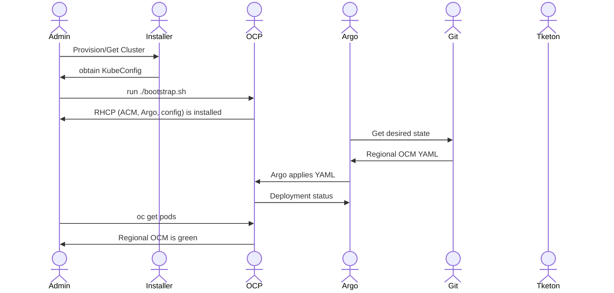

# Bootstrap

This repository contains the scripting, configuration, GitOps content, and documentation necessary to bootstrap a region of a cloud service for Red Hat, based on OpenShift and the Red Hat products and supported community projects that we leverage in our reference architecture.  

# Install

## OpenShift

An initial OpenShift cluster is required to act as the bootstrap cluster and centralized/global control plane.

Obtaining or provisioning the bootstrap cluster is beyond the scope of this document, but the [example install-config.yaml](./examples/install-config.yaml)
was generated by the OpenShift installer to create an OCP cluster and is used as the basis for testing this project. 

The rest of this document assumes you are `kubeadmin` with a KUBECONFIG.


## Secrets

AWS accounts and image pull secrets are inputs into the provisioning process. They will be obtained by external
processes, stored in predictable vault paths, and delivered to our clusters.

Until there is Vault, we must create the `aws-creds` and `pull-secret` Secrets for each cluster provisioned.

Currently, this project assumes the same credentials and pull secrets for all clusters.

From ACM, retrieve the `aws-creds` and `pull-secret`, store them locally, and apply them to your cluster/namespace when needed.

```
# TODO: get the correct namespace for these secrets
oc get secret aws-creds -n hive-managed-clusters -o yaml > aws-creds.yaml
oc get secret pull-secret -n hive-managed-clusters -o yaml > pull-secret.yaml
```



