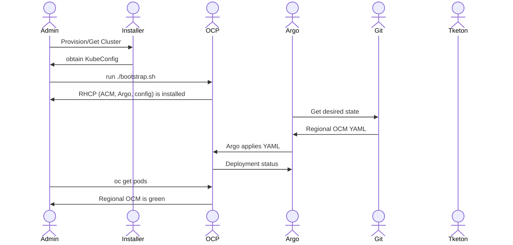

# Bootstrap

This repository contains the scripting, configuration, GitOps content, and documentation necessary to bootstrap a region of a cloud service for Red Hat, based on OpenShift and the Red Hat products and supported community projects that we leverage in our reference architecture.  


# Install

Basic manual install



# Secrets

Until there is Vault and secrets we can rely on, we must create and apply 2 secrets for each cluster created.

From ACM, retrieve the `aws-creds` and `pull-secret`, store them locally, and apply them to your cluster/namespace when needed.

```
oc get secret aws-creds -n hive-managed-clusters -o yaml > aws-creds.yaml
oc get secret pull-secret -n hive-managed-clusters -o yaml > pull-secret.yaml
```

