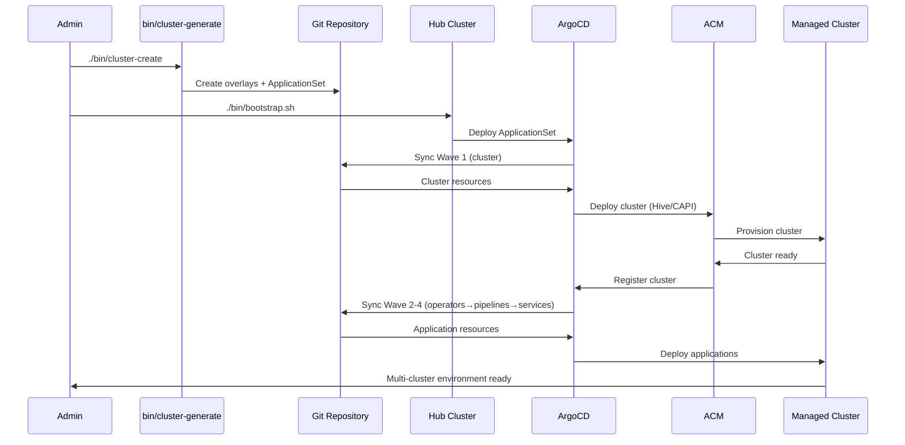

# OpenShift Bootstrap

**A reusable GitOps framework for multi-cluster management.** Clone this repository to instantly deploy a complete OpenShift hub cluster that can provision and manage regional clusters at scale.

## Quick Reuse

```bash
# 1. Clone and bootstrap
git clone https://github.com/openshift-online/bootstrap.git
cd bootstrap
oc login https://api.your-hub-cluster.example.com:6443
oc apply -k clusters/global/

# 2. Add your first cluster
./bin/cluster-create

# 3. Done - GitOps handles the rest
```

## What You Get

This repository provides a **complete reusable infrastructure**:
- **Self-Managing Hub** - ArgoCD, ACM, Vault, Pipelines all configured automatically
- **Two-Phase Reuse** - GitHub for bootstrap, internal Gitea for cluster-specific configs  
- **Automatic Provisioning** - OpenShift (via Hive) and EKS (via CAPI) cluster creation
- **Zero-Config GitOps** - ApplicationSets with proper dependency ordering
- **Semantic Organization** - Intuitive directory structure for easy navigation

**Key benefit:** From zero to production-ready multi-cluster environment in minutes, not days.

## 🏗️ Architecture Overview

**Hub-Spoke Model**: One OpenShift hub cluster manages multiple regional clusters (OpenShift or EKS) using GitOps automation.

- **Hub Cluster**: Runs ArgoCD, ACM, and all cluster management operators
- **Managed Clusters**: Regional OpenShift (OCP) or EKS clusters provisioned and managed automatically
- **Automated Provisioning**: Single command creates complete cluster overlays with proper GitOps integration

## 📁 Directory Structure & Navigation

The repository uses **semantic directory organization** designed for intuitive navigation. Each directory level follows consistent patterns that clearly indicate purpose and scope.

### 🔍 Semantic Organization Patterns

**Top-level directories:**
- `clusters/` - All cluster resources (hub and managed)
- `bases/` - Reusable template components
- `bin/` - Management scripts

**Consolidated structure:**
```bash
clusters/
├── global/                      # Hub cluster resources
│   ├── operators/              # ACM, GitOps, Pipelines, Vault
│   ├── pipelines/              # Hub provisioner pipelines
│   └── gitops/                 # ArgoCD ApplicationSets
└── {cluster-name}/             # Managed cluster (e.g., ocp-02, eks-01)
    ├── {cluster-name}.yaml     # Cluster specification
    ├── cluster/                # Provisioning resources (Hive/CAPI)
    ├── operators/              # Cluster operators
    ├── pipelines/              # Cluster pipelines
    ├── deployments/            # Cluster deployments
    └── gitops/                 # Cluster GitOps apps

bases/
├── clusters/                   # Cluster provisioning templates
├── operators/                  # Operator base configurations
└── pipelines/                  # Reusable Tekton pipelines
```

## 🧭 Navigation Pattern

```bash
# View all clusters
ls clusters/                        # → global, ocp-02, ocp-03, eks-01

# View hub cluster resources
ls clusters/global/                 # → operators, pipelines, gitops
ls clusters/global/operators/       # → advanced-cluster-management, gitops-integration, openshift-gitops, openshift-pipelines, vault

# View managed cluster resources
ls clusters/ocp-02/                 # → ocp-02.yaml, cluster, operators, pipelines, deployments, gitops

# View reusable bases
ls bases/                           # → clusters, operators, pipelines
```

## 🚀 How Reuse Works

### Two-Phase Bootstrap Pattern

**Phase 1: Bootstrap from GitHub**
```bash
git clone https://github.com/openshift-online/bootstrap.git
oc apply -k clusters/global/
```

**Phase 2: Self-Referential Management**
After bootstrap, your cluster becomes self-managing:
- Internal Gitea service contains cluster-specific configurations
- ArgoCD switches to internal Git for ongoing management
- New clusters reference their own internal Git repository

### Adding Clusters (Simple)

```bash
./bin/cluster-create    # Interactive cluster specification
# GitOps automatically handles the rest
```

**The system automatically:**
- ✅ Creates cluster provisioning resources (OpenShift/EKS)
- ✅ Generates pipeline deployments  
- ✅ Configures operator installations
- ✅ Sets up service deployments
- ✅ Orders deployment with sync waves
- ✅ Integrates with ACM management

## 📖 Documentation

- **[REUSE.md](./REUSE.md)** - How to clone and reuse this repository
- **[BOOTSTRAP.md](./BOOTSTRAP.md)** - Step-by-step bootstrap walkthrough  
- **[docs/getting-started/QUICKSTART.md](./docs/getting-started/QUICKSTART.md)** - 5-minute overview
- **[docs/architecture/ARCHITECTURE.md](./docs/architecture/ARCHITECTURE.md)** - Visual architecture diagrams  

## 🏛️ Architecture & Components

### Hub Cluster Components
- **OpenShift GitOps (ArgoCD)**: Manages all cluster deployments via ApplicationSets
- **Red Hat Advanced Cluster Management (ACM)**: Multi-cluster lifecycle and governance
- **Cluster API (CAPI)**: EKS cluster provisioning with AWS infrastructure provider
- **Hive**: OpenShift cluster provisioning operator
- **OpenShift Pipelines (Tekton)**: CI/CD automation across all clusters

### Deployment Flow with Sync Waves
ApplicationSets deploy resources in ordered waves to ensure proper dependencies:

1. **Wave 1**: Cluster provisioning (Hive ClusterDeployment or CAPI resources)
2. **Wave 2**: Operator installation (OpenShift Pipelines operator)
3. **Wave 3**: Pipeline deployment (Tekton Pipeline and PipelineRun resources)
4. **Wave 4**: Service deployment (OCM database services and applications)

### GitOps Integration
- **Automated cluster registration**: ACM automatically registers managed clusters with ArgoCD
- **ApplicationSet pattern**: Single ApplicationSet generates all required applications per cluster
- **Resource exclusions**: ArgoCD excludes transient resources like TaskRuns but allows Pipeline/PipelineRun
- **Multi-platform support**: Seamlessly manages both OpenShift and EKS clusters


## 🔄 Workflow Diagram



## 🛠️ Development & Troubleshooting

- **Validation**: All overlays include `kustomize build` validation and dry-run checks
- **Monitoring**: Built-in status monitoring scripts for cluster provisioning
- **Rollback**: Clean rollback procedures for failed deployments
- **Extensibility**: Base template system allows easy addition of new services and pipelines

**For detailed installation and troubleshooting guidance, see [docs/getting-started/production-installation.md](./docs/getting-started/production-installation.md)**
