# OpenShift Bootstrap

Multi-cluster OpenShift and EKS management using GitOps automation. This repository provides everything needed to bootstrap and manage regional cluster deployments with a centralized hub cluster approach.

## 🏗️ Architecture Overview

**Hub-Spoke Model**: One OpenShift hub cluster manages multiple regional clusters (OpenShift or EKS) using GitOps automation.

- **Hub Cluster**: Runs ArgoCD, ACM, and all cluster management operators
- **Managed Clusters**: Regional OpenShift (OCP) or EKS clusters provisioned and managed automatically
- **Automated Provisioning**: Single command creates complete cluster overlays with proper GitOps integration

## 📁 Directory Structure & Navigation

The repository is designed for **intuitive navigation** with each directory level showing your next options:

### 🔧 Generation Input (where you start)
```bash
regions/                          # Available AWS regions
├── us-east-1/                   # Region-specific clusters
│   ├── cluster-10/              # Individual cluster specifications
│   │   └── region.yaml          # ← START HERE: cluster configuration
│   └── cluster-20/
└── us-west-2/
    └── cluster-40/
```

### 🏭 Base Templates (shared components)
```bash
bases/
├── clusters/                    # Common cluster templates
├── pipelines/                   # Reusable Tekton pipelines
└── ocm/                        # OCM service templates
```

### 🎯 Generated Overlays (automated output)
```bash
clusters/                        # Cluster provisioning (auto-generated)
├── cluster-10/                 # OCP cluster (Hive resources)
├── cluster-20/                 # OCP cluster (Hive resources)  
└── cluster-40/                 # EKS cluster (CAPI resources)

pipelines/                       # Pipeline deployments (auto-generated)
├── hello-world/
│   ├── cluster-10/             # Pipeline runs for cluster-10
│   └── cluster-20/             # Pipeline runs for cluster-20
└── cloud-infrastructure-provisioning/
    ├── cluster-10/
    └── cluster-20/

deployments/                     # Service deployments (auto-generated)
└── ocm/
    ├── cluster-10/             # OCM services for cluster-10
    └── cluster-20/             # OCM services for cluster-20

operators/                       # Operator deployments
├── advanced-cluster-management/
│   └── global/                 # ACM hub cluster deployment
└── openshift-pipelines/
    ├── global/                 # Pipelines hub cluster deployment
    ├── cluster-10/             # Pipelines operator for cluster-10
    ├── cluster-20/             # Pipelines operator for cluster-20
    └── cluster-40/             # Pipelines operator for cluster-40
```

### 🚀 GitOps Applications (orchestration)
```bash
gitops-applications/             # ArgoCD ApplicationSets
├── cluster-10.yaml            # ApplicationSet for cluster-10 (all components)
├── cluster-20.yaml            # ApplicationSet for cluster-20 (all components)
└── kustomization.yaml          # Main GitOps entry point
```

## 🧭 Navigation Pattern

**Each level shows your next options** - making discovery and management intuitive:

```bash
# Start with regions to see what's available
ls regions/                     # → us-east-1, us-west-2, eu-west-1

# Drill down to see clusters in a region  
ls regions/us-east-1/          # → cluster-10, cluster-20, cluster-30

# See what's deployed for any cluster
ls clusters/                   # → cluster-10, cluster-20, cluster-40
ls pipelines/hello-world/      # → cluster-10, cluster-20, cluster-40  
ls deployments/ocm/           # → cluster-10, cluster-20, cluster-40
ls operators/openshift-pipelines/ # → global, cluster-10, cluster-20, cluster-40

# Check GitOps applications
ls gitops-applications/       # → cluster-10.yaml, cluster-20.yaml, global/
```

**🎯 Key Navigation Benefits:**
- **Consistent pattern**: Every directory level follows the same structure
- **Self-documenting**: Directory names clearly indicate their purpose  
- **Easy discovery**: `ls` at any level shows your available options
- **Logical grouping**: Related resources are co-located
- **Global vs Regional**: Clear separation between hub cluster (`global/`) and managed cluster (`cluster-XX/`) deployments

## 🚀 Quick Start

### Adding a New Cluster (3 simple steps)

1. **Create regional specification:**
```bash
mkdir -p regions/us-west-2/cluster-50/
cat > regions/us-west-2/cluster-50/region.yaml << EOF
type: eks                    # "ocp" or "eks"
name: cluster-50
region: us-west-2
domain: rosa.mturansk-test.csu2.i3.devshift.org
instanceType: m5.large
replicas: 3
EOF
```

2. **Generate complete cluster overlay:**
```bash
./bin/generate-cluster regions/us-west-2/cluster-50/
```

3. **Deploy via GitOps:**
```bash
./bootstrap.sh
```

**That's it!** The system automatically:
- ✅ Creates cluster provisioning resources (OCP via Hive, EKS via CAPI)
- ✅ Generates pipeline deployments (Hello World, Cloud Infrastructure)
- ✅ Sets up operator installations (OpenShift Pipelines)
- ✅ Configures service deployments (OCM database services)
- ✅ Creates ApplicationSet with proper sync wave ordering
- ✅ Integrates with ACM for cluster management

## 📖 Documentation

- **[INSTALL.md](./INSTALL.md)** - Complete installation guide (hub setup + adding regions)
- **[NEWREGION.md](./NEWREGION.md)** - Detailed test plan for new cluster deployment
- **[CLAUDE.md](./CLAUDE.md)** - Project overview and development guidance  

## 🏛️ Architecture & Components

### Hub Cluster Components
- **OpenShift GitOps (ArgoCD)**: Manages all cluster deployments via ApplicationSets
- **Red Hat Advanced Cluster Management (ACM)**: Multi-cluster lifecycle and governance
- **Cluster API (CAPI)**: EKS cluster provisioning with AWS infrastructure provider
- **Hive**: OpenShift cluster provisioning operator
- **OpenShift Pipelines (Tekton)**: CI/CD automation across all clusters

### Deployment Flow with Sync Waves
ApplicationSets deploy resources in ordered waves to ensure proper dependencies:

1. **Wave 1**: Cluster provisioning (Hive ClusterDeployment or CAPI resources)
2. **Wave 2**: Operator installation (OpenShift Pipelines operator)
3. **Wave 3**: Pipeline deployment (Tekton Pipeline and PipelineRun resources)
4. **Wave 4**: Service deployment (OCM database services and applications)

### GitOps Integration
- **Automated cluster registration**: ACM automatically registers managed clusters with ArgoCD
- **ApplicationSet pattern**: Single ApplicationSet generates all required applications per cluster
- **Resource exclusions**: ArgoCD excludes transient resources like TaskRuns but allows Pipeline/PipelineRun
- **Multi-platform support**: Seamlessly manages both OpenShift and EKS clusters


## 🔄 Workflow Diagram

```mermaid
sequenceDiagram
   participant Admin
   participant Generator as bin/generate-cluster
   participant Git as Git Repository
   participant Hub as Hub Cluster
   participant ArgoCD
   participant ACM
   participant Target as Managed Cluster
   
   Admin->>Generator: ./bin/generate-cluster regions/us-west-2/cluster-50/
   Generator->>Git: Create overlays + ApplicationSet
   
   Admin->>Hub: ./bootstrap.sh
   Hub->>ArgoCD: Deploy ApplicationSet
   
   ArgoCD->>Git: Sync Wave 1 (cluster)
   Git->>ArgoCD: Cluster resources
   ArgoCD->>ACM: Deploy cluster (Hive/CAPI)
   ACM->>Target: Provision cluster
   
   Target->>ACM: Cluster ready
   ACM->>ArgoCD: Register cluster
   
   ArgoCD->>Git: Sync Wave 2-4 (operators→pipelines→services)
   Git->>ArgoCD: Application resources
   ArgoCD->>Target: Deploy applications
   
   Target->>Admin: Multi-cluster environment ready
```



## 🛠️ Development & Troubleshooting

- **Validation**: All overlays include `kustomize build` validation and dry-run checks
- **Monitoring**: Built-in status monitoring scripts for cluster provisioning
- **Rollback**: Clean rollback procedures for failed deployments
- **Extensibility**: Base template system allows easy addition of new services and pipelines

**For detailed installation and troubleshooting guidance, see [INSTALL.md](./INSTALL.md)**
