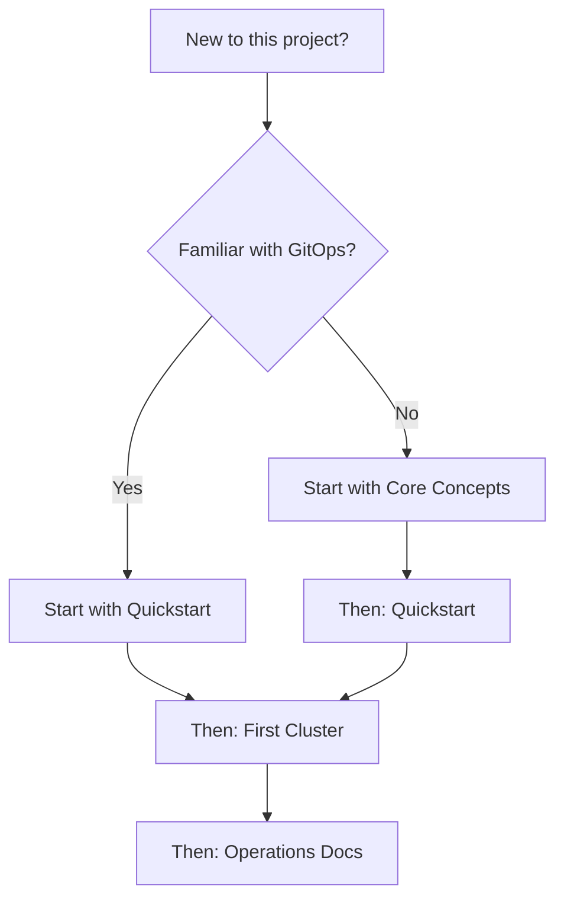
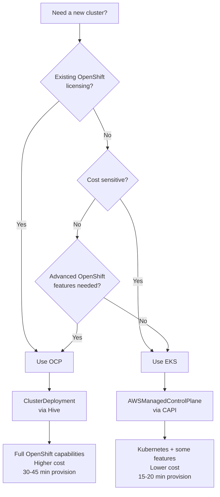
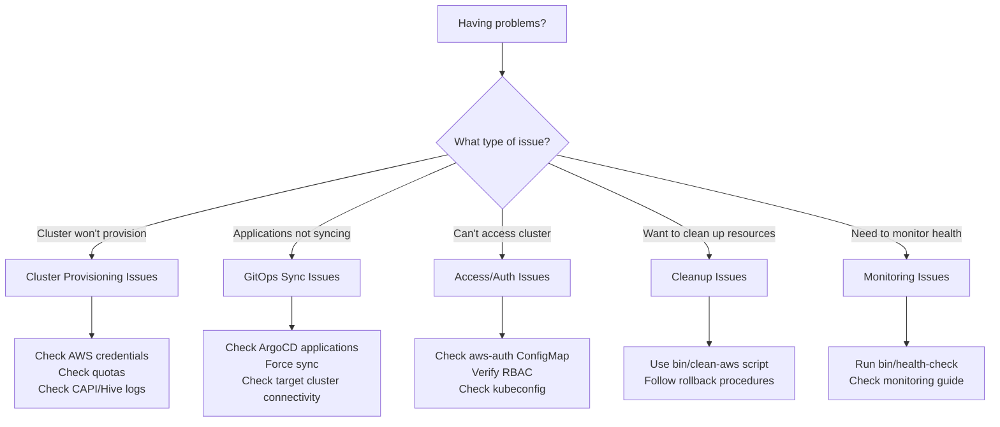
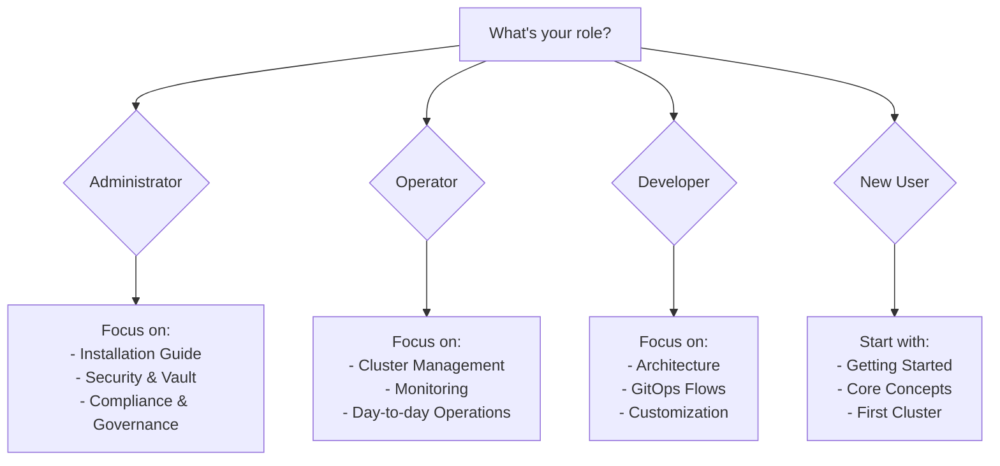

# Which Path Should I Take?

**Interactive decision tree to guide your documentation journey**

## 🤔 What's Your Situation?

### New to This Project?

**Recommended Path:**
- **GitOps Familiar**: [Quickstart](./quickstart.md) → [First Cluster](./first-cluster.md) → [Operations](../operations/cluster-management.md)
- **GitOps New**: [Core Concepts](./concepts.md) → [Quickstart](./quickstart.md) → [First Cluster](./first-cluster.md)

### What Cluster Type Should I Choose?

**Decision Factors:**
- **Choose OCP if**: You need full OpenShift features, have existing licensing, or require advanced operators
- **Choose EKS if**: You want cost optimization, faster provisioning, or basic Kubernetes is sufficient

### I Have Issues - Where Should I Go?

**Quick Solutions:**
- **Provisioning**: [Troubleshooting Guide](../operations/troubleshooting.md#cluster-provisioning)
- **GitOps**: [Monitoring Guide](../operations/monitoring.md#troubleshooting-workflow)
- **Access**: [EKS Auth Setup](../eks-aws-auth-setup.md)
- **Cleanup**: [AWS Cleanup Guide](../../bin/clean-aws.md)

### What Role Am I In?

**Role-Based Paths:**
- **Administrator**: [Installation](../../INSTALL.md) → [Vault Setup](../../VAULT-SETUP.md) → [Operations](../operations/cluster-management.md)
- **Operator**: [Quickstart](./quickstart.md) → [Cluster Management](../operations/cluster-management.md) → [Monitoring](../operations/monitoring.md)
- **Developer**: [Architecture](../../ARCHITECTURE.md) → [Core Concepts](./concepts.md) → [GitOps Flow](../architecture/gitops-flow.md)
- **New User**: [Core Concepts](./concepts.md) → [Quickstart](./quickstart.md) → [First Cluster](./first-cluster.md)

## 📋 Quick Checklists

### Pre-Deployment Checklist
- [ ] Hub cluster running and accessible
- [ ] AWS credentials configured (`aws sts get-caller-identity`)
- [ ] Pull secrets available (for OCP clusters)
- [ ] Required tools installed (`oc`, `kubectl`, `kustomize`)
- [ ] Understanding of cluster type choice (OCP vs EKS)

### Post-Deployment Validation
- [ ] Cluster provisioned successfully
- [ ] ACM shows cluster as "Available"
- [ ] ArgoCD applications all "Synced/Healthy"
- [ ] Services running on target cluster
- [ ] Health check shows no errors

### Troubleshooting Checklist
- [ ] Checked recent logs for errors
- [ ] Verified AWS credentials and quotas
- [ ] Confirmed network connectivity
- [ ] Reviewed ArgoCD application status
- [ ] Checked ACM ManagedCluster status
- [ ] Validated target cluster access

## 🎯 Task-Based Navigation

### "I want to..."

#### Deploy a new cluster
→ [First Cluster Guide](./first-cluster.md) or [Cluster Creation Guide](../../guides/cluster-creation.md)

#### Understand the architecture
→ [Core Concepts](./concepts.md) → [Architecture Overview](../../ARCHITECTURE.md)

#### Monitor cluster health
→ [Monitoring Guide](../operations/monitoring.md)

#### Troubleshoot issues
→ [Troubleshooting Guide](../operations/troubleshooting.md)

#### Clean up AWS resources
→ [AWS Cleanup Guide](../../bin/clean-aws.md)

#### Set up Vault integration
→ [Vault Setup Guide](../../VAULT-SETUP.md)

#### Manage day-to-day operations
→ [Cluster Management Guide](../operations/cluster-management.md)

#### Get quick command reference
→ [Command Reference](../reference/commands.md)

#### Understand GitOps workflow
→ [GitOps Flow Documentation](../architecture/gitops-flow.md)

## 🔄 Learning Progression

### Beginner → Intermediate → Advanced

**Beginner Path:**
1. [Core Concepts](./concepts.md) - Understand the basics
2. [Quickstart](./quickstart.md) - See the workflow
3. [First Cluster](./first-cluster.md) - Hands-on experience

**Intermediate Path:**
4. [Cluster Management](../operations/cluster-management.md) - Day-to-day operations
5. [Monitoring](../operations/monitoring.md) - Health checking
6. [Architecture Deep Dive](../architecture/gitops-flow.md) - Technical details

**Advanced Path:**
7. [Vault Integration](../../VAULT-SETUP.md) - Advanced security
8. [Customization](../architecture/customization.md) - Extending the system
9. [Troubleshooting Mastery](../operations/troubleshooting.md) - Expert-level problem solving

## 🚀 Quick Start Based on Time Available

### 5 minutes
→ [Quickstart Guide](./quickstart.md)

### 15 minutes  
→ [Core Concepts](./concepts.md)

### 45 minutes
→ [First Cluster Deployment](./first-cluster.md)

### 2 hours
→ Complete [Getting Started](./README.md) section

### Half day
→ Getting Started + [Operations](../operations/cluster-management.md)

### Full day
→ Complete documentation review + hands-on deployment