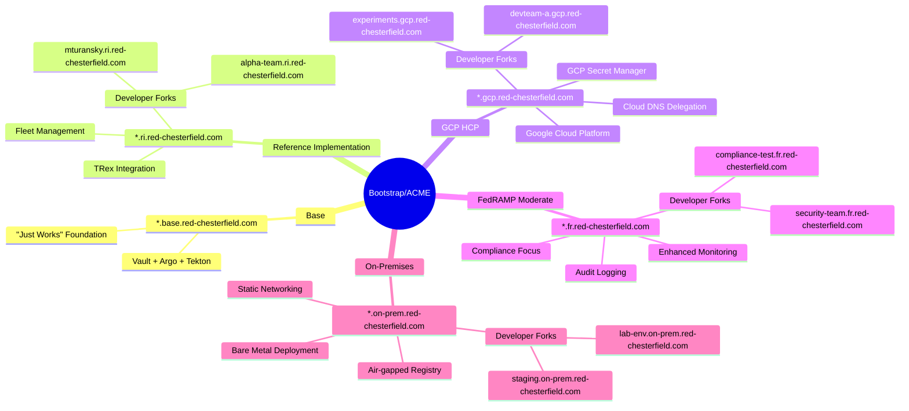

# Bootstrap Reuse Architecture

## Overview

This document outlines a fork-based reuse architecture that enables multiple projects to share a common Bootstrap/ACME infrastructure foundation while maintaining project-specific customizations. The architecture supports complete infrastructure component replacement through override directories while preserving upstream rebase capability.

## Fork Architecture Visualization



## Project Requirements

### Core Concept: Fork-Based Multi-Project Architecture

**Bootstrap/ACME Base Project:**
- Domain: `*.red-chesterfield.com` (e.g., `*.base.red-chesterfield.com`)
- "Just works" vanilla installation with core components (Vault, Argo, Tekton)
- Shared patterns, documentation, and common infrastructure code
- Always functional as standalone deployment

**Four Project Forks:**
1. **Reference Implementation**: `*.ri.red-chesterfield.com` - Uses TRex as example payload
2. **GCP HCP**: `*.gcp.red-chesterfield.com` - Google Cloud version with DNS delegation
3. **FedRAMP Moderate**: `*.fr.red-chesterfield.com` - Compliance-focused deployment
4. **On-Premises**: `*.on-prem.red-chesterfield.com` - Pre-configured on-prem clusters

### Key Design Principles

1. **"Just Works" Philosophy**: Base and any fork should deploy successfully with minimal configuration
2. **Domain Isolation**: Each project has unique DNS wildcard domain for complete isolation
3. **Component Replaceability**: Any infrastructure component can be removed/replaced per fork
4. **Upstream Compatibility**: All forks should easily rebase to new Bootstrap versions
5. **Configuration-Driven**: Small config changes enable fork-specific behavior
6. **GitOps Native**: All changes managed through existing GitOps ApplicationSet structure

## Architectural Approach

### Repository Structure
```
bootstrap/                              # Upstream "just works" base
├── bases/                             # Shared infrastructure components
│   ├── clusters/                      # Cluster deployment templates
│   └── pipelines/                     # CI/CD pipeline templates
├── operators/                         # Core operators (Vault, GitOps, ACM, etc.)
├── gitops-applications/global/        # Base ApplicationSets
├── overrides/                         # NEW: Fork-specific override patterns
│   ├── README.md                      # Override documentation and patterns
│   ├── examples/                      # Example override implementations
│   │   ├── remove-vault/              # Replace Vault with alternative
│   │   ├── aws-to-gcp/                # AWS → GCP infrastructure changes
│   │   ├── fedramp-compliance/        # FedRAMP-specific modifications
│   │   └── domain-config/             # Domain-specific configurations
│   └── templates/                     # Reusable override templates
├── bootstrap.config                   # Fork-specific configuration (gitignored)
└── bin/bootstrap                      # Enhanced with override processing
```

### Bootstrap Configuration Schema
```yaml
# bootstrap.config (fork-specific, not committed to upstream)
project:
  name: "reference-implementation"
  baseDomain: "ri.red-chesterfield.com"
  
infrastructure:
  provider: "aws"                      # aws, gcp, azure, on-prem
  region: "us-east-1"
  machineTypes:
    master: "m5.xlarge"
    worker: "m5.large"
  
# Component management through overrides
overrides:
  # Completely remove components
  removeComponents:
    - "vault"                          # Remove if using cloud-native secrets
    - "aws-load-balancer-controller"   # Remove for GCP deployments
  
  # Replace components with alternatives
  replaceComponents:
    - name: "external-secrets"
      with: "overrides/gcp-secret-manager"
    - name: "networking"  
      with: "overrides/gcp-networking"
    - name: "monitoring"
      with: "overrides/fedramp-monitoring"
      
  # Apply additional configuration overlays
  additionalOverlays:
    - "overrides/domain-certificates"
    - "overrides/custom-rbac"

# Developer subdomain configuration    
developers:
  - name: "mturansky"
    subdomain: "mturansky.ri.red-chesterfield.com"
  - name: "team-alpha"
    subdomain: "alpha.ri.red-chesterfield.com"
```

### Override Directory Pattern

Override directories use Kustomize overlay patterns to selectively replace or remove components:

```
overrides/remove-vault/
├── kustomization.yaml              # Removes vault from gitops-applications
└── replacement-secret-store/       # Alternative implementation
    ├── external-secrets-operator.yaml
    ├── cluster-secret-store.yaml
    └── kustomization.yaml

overrides/gcp-networking/
├── kustomization.yaml              # Replaces AWS networking components
├── gcp-load-balancer.yaml          # GCP-specific load balancer
├── cloud-dns-config.yaml          # Cloud DNS configuration
└── vpc-native-networking.yaml     # GCP VPC-native networking
```

### Fork Initialization Process

1. **Clone Bootstrap**: `git clone https://github.com/openshift-online/bootstrap project-fork`
2. **Set Upstream**: `git remote add upstream https://github.com/openshift-online/bootstrap`
3. **Create Configuration**: Generate `bootstrap.config` for project-specific settings
4. **Apply Overrides**: `./bin/bootstrap` processes overrides during deployment
5. **Deploy Infrastructure**: Standard GitOps deployment with project customizations

### Component Replacement Strategy

**Removal Pattern** (remove-vault example):
```yaml
# overrides/remove-vault/kustomization.yaml
apiVersion: kustomize.config.k8s.io/v1beta1
kind: Kustomization

resources:
- ../../gitops-applications/global

patchesStrategicMerge:
- remove-vault-application.yaml

# Remove vault from global kustomization
patches:
- target:
    kind: Kustomization
    name: global
  patch: |-
    - op: remove
      path: /resources
      value: vault.application.yaml
```

**Replacement Pattern** (vault → gcp-secret-manager):
```yaml
# overrides/gcp-secret-manager/kustomization.yaml
apiVersion: kustomize.config.k8s.io/v1beta1
kind: Kustomization

resources:
- ../../gitops-applications/global
- gcp-secret-manager.application.yaml

patchesStrategicMerge:
- remove-vault-application.yaml
```

## Project-Specific Implementations

### Reference Implementation (ri.red-chesterfield.com)
- **Purpose**: Demonstrate TRex integration with fleet management
- **Overrides**: Add TRex ApplicationSets, remove non-essential components
- **Configuration**: Standard AWS deployment with TRex-specific networking

### GCP HCP (gcp.red-chesterfield.com)
- **Purpose**: Google Cloud Platform deployment
- **Overrides**: Replace AWS components with GCP equivalents, GCP Secret Manager
- **DNS Setup**: Parent hosted zone in AWS delegates to GCP Cloud DNS
- **Configuration**: GCP-specific machine types, networking, and identity

### FedRAMP Moderate (fr.red-chesterfield.com)
- **Purpose**: Compliance-focused deployment
- **Overrides**: Enhanced monitoring, audit logging, compliance policies
- **Configuration**: Restricted instance types, additional security operators

### On-Premises (on-prem.red-chesterfield.com)
- **Purpose**: Pre-configured on-premises deployment
- **Overrides**: Remove cloud-specific components, add bare-metal provisioning
- **Configuration**: Static networking, local storage, air-gapped registry

## Upstream Integration and Version Management

### Rebase Strategy
Each fork maintains upstream compatibility through Git rebase workflow:

```bash
# Regular upstream sync process
git fetch upstream
git rebase upstream/main

# Handle override conflicts during rebase
git status                           # Check for conflicts in overrides/
vim overrides/*/kustomization.yaml   # Resolve any conflicts
git add overrides/
git rebase --continue
```

### Release Management
- Bootstrap uses semantic versioning with tagged releases
- Each fork rebases to new Bootstrap versions independently  
- Override compatibility maintained across Bootstrap versions
- Migration guides provided for breaking changes

### Contribution Flow
Improvements flow from forks back to upstream Bootstrap:
1. Fork develops enhancement in override directory
2. Generalize enhancement for multiple use cases
3. Submit PR to upstream Bootstrap
4. Enhancement becomes available to all forks

## Implementation Timeline

### Phase 1: Foundation (Current)
- [x] Document requirements and architecture
- [ ] Create `overrides/` directory structure
- [ ] Implement `bootstrap.config` parsing in `./bin/bootstrap`
- [ ] Create example override patterns

### Phase 2: Fork Creation
- [ ] Initialize Reference Implementation fork
- [ ] Create GCP HCP override implementations
- [ ] Develop FedRAMP compliance overrides
- [ ] Build on-premises deployment overrides

### Phase 3: Integration & Testing
- [ ] Validate "just works" behavior across all forks
- [ ] Test upstream rebase scenarios
- [ ] Implement automated compatibility testing
- [ ] Document operational procedures

### Phase 4: Production Deployment
- [ ] Deploy Reference Implementation
- [ ] Roll out remaining project forks
- [ ] Establish upstream contribution workflow
- [ ] Monitor and iterate based on usage

## Architecture Benefits

### ✅ **Fork-Based Isolation**
- Complete project separation through repository forks
- Project-specific DNS domains prevent configuration conflicts
- Independent deployment and operational control

### ✅ **Component Replaceability**  
- Any infrastructure component can be removed or replaced
- No forced standards - projects choose their own implementations
- Override directories preserve upstream rebase capability

### ✅ **"Just Works" Experience**
- Base Bootstrap deploys successfully without configuration
- Forks inherit working foundation, customize as needed
- Domain-specific configuration enables rapid project spinup

### ✅ **Upstream Compatibility**
- Git rebase workflow preserves local customizations
- Override conflicts isolated to specific directories
- Shared improvements benefit all projects through upstream contributions

### ✅ **Operational Simplicity**
- Single `./bin/bootstrap` command handles all deployment complexity
- GitOps-native patterns throughout all implementations
- Standard Kubernetes and OpenShift operational practices

The architecture enables multiple projects to leverage proven Bootstrap infrastructure patterns while maintaining complete autonomy over their specific implementations and requirements.