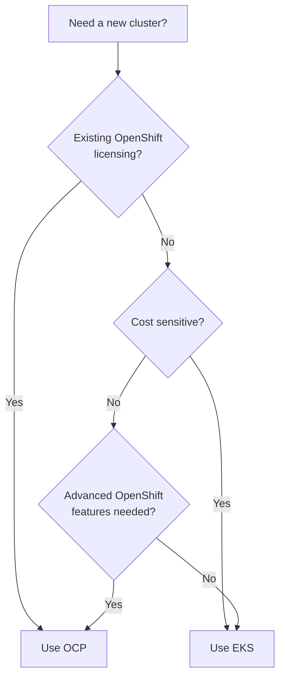

# Documentation Structure Analysis & Improvement Plan

## Current Documentation Architecture

### 📁 **Root Level Documentation**
- **`README.md`** (Main entry point) - Comprehensive architectural overview with intuitive navigation patterns
- **`CLAUDE.md`** (Claude instructions) - Detailed project overview and development guidance  
- **`ARCHITECTURE.md`** - Visual architecture diagram with GitOps sync wave flows
- **`STATUS.md`** - Live cluster status with auto-generated health checks
- **`operators/vault/global/VAULT-SETUP.md`** - Complete Vault + ESO integration guide

### 📁 **Specialized Documentation**
- **`NEWREGION.md`** - Interactive test plan for new cluster deployment
- **`docs/getting-started/production-installation.md`** - Complete installation guide
- **`KUSTOMIZATION.md`** - Kustomize configuration management
- **`STATUSCHECKING.md`** - Status monitoring guidance
- **`CONVERTER.md`** - Conversion utilities
- **`REGIONALSPEC.md`** - Regional specification details

### 📁 **Technical Documentation (`docs/`)**
- **`eks-aws-auth-setup.md`** - EKS authentication setup
- **`plugin-decisions/`** - Architectural decision records with templates

### 📁 **Component Documentation**
- **`operators/advanced-cluster-management/global/README.md`** - ACM deployment guide
- **`operators/openshift-pipelines/global/README.md`** - Pipeline operator documentation
- Various component-specific READMEs throughout the operator hierarchy

## Current Strengths

### ✅ **Excellent Navigation Design**
- **Self-documenting structure**: Directory names clearly indicate purpose
- **Consistent patterns**: Every level follows same structure conventions
- **Discovery-friendly**: `ls` at any level shows next options
- **Logical grouping**: Related resources co-located

### ✅ **Comprehensive Coverage**
- **Architecture focus**: Visual diagrams and flow explanations
- **Operational guidance**: Real-world usage patterns and troubleshooting
- **Technical depth**: Detailed implementation specifics
- **Interactive tools**: Test plans and generation workflows

### ✅ **Living Documentation**
- **Auto-generated status**: `STATUS.md` updates from health checks
- **Context-aware**: Documentation references current cluster states
- **Implementation-linked**: Documentation points to actual code

## Suggested Improvements

### 🎯 **1. Documentation Discovery & Navigation**

#### **Create Documentation Index**
```bash
# Suggested: docs/INDEX.md
# Quick reference linking to all documentation with clear purpose statements
```

**Purpose**: Single entry point showing all available documentation with 1-line descriptions

#### **Category-Based Organization**
```
docs/
├── getting-started/          # New user onboarding
│   ├── quickstart.md         # 5-minute setup guide  
│   ├── concepts.md           # Core concepts explained
│   └── first-cluster.md      # Deploy your first cluster
├── operations/               # Day-to-day operations
│   ├── cluster-management.md # Managing existing clusters
│   ├── troubleshooting.md    # Common issues & solutions
│   └── monitoring.md         # Health checking & alerts
├── architecture/             # Technical deep-dives
│   ├── gitops-flow.md        # GitOps workflow details
│   ├── security.md           # Security model & practices
│   └── integration/          # Integration details
└── reference/                # Quick reference materials
    ├── commands.md           # Common commands cheat sheet
    ├── api-reference.md      # Resource definitions
    └── troubleshooting-matrix.md # Error codes & solutions
```

### 🎯 **2. User Experience Improvements**

#### **Progressive Documentation Strategy**
1. **Quick Start Path**: Get users running fast
2. **Guided Learning**: Step-by-step skill building  
3. **Expert Reference**: Deep technical details

#### **Add Documentation Headers**
```markdown
# Document Title
**Audience**: [Operators | Developers | Administrators]
**Complexity**: [Beginner | Intermediate | Advanced]  
**Estimated Time**: [5 minutes | 30 minutes | 1 hour]
**Prerequisites**: List of required knowledge/setup
```

### 🎯 **3. Content Organization Improvements**

#### **Split Large Files**
- **`CLAUDE.md`** (2,500+ lines) → Split into focused sections:
  - `CLAUDE-OVERVIEW.md` - Basic project info
  - `CLAUDE-ARCHITECTURE.md` - Technical details
  - `CLAUDE-OPERATIONS.md` - Common commands & workflows
  - `CLAUDE-TROUBLESHOOTING.md` - Known issues & fixes

#### **Create Topic-Focused Guides**
```
guides/
├── cluster-provisioning.md   # End-to-end cluster creation
├── vault-integration.md      # Secret management with Vault
├── pipeline-development.md   # Creating custom pipelines  
├── aws-resource-cleanup.md   # AWS cleanup procedures
└── backup-recovery.md        # Backup & disaster recovery
```

### 🎯 **4. Cross-Reference & Linking**

#### **Consistent Cross-References**
- Add "Related Documentation" sections
- Use consistent file path references (`file_path:line_number`)
- Create bidirectional links between related topics

#### **Visual Navigation Aids**
```markdown
## 📍 You Are Here
Architecture Overview → GitOps Integration → **ArgoCD Configuration**

## 🔗 Related Topics
- [Cluster Provisioning](../operations/cluster-provisioning.md)
- [Troubleshooting GitOps](../troubleshooting/gitops.md)
- [Security Configuration](../architecture/security.md)
```

### 🎯 **5. Interactive Elements**

#### **Decision Trees**
```markdown
## Which Cluster Type Should I Use?



#### **Checklists & Templates**
- Pre-deployment checklists
- Post-deployment validation
- Troubleshooting decision trees

### 🎯 **6. Tool Integration**

#### **Generate Documentation Automatically**
```bash
# Add to bin/
├── generate-docs          # Auto-generate component docs
├── validate-docs          # Check for broken links
└── update-status-docs     # Refresh dynamic content
```

#### **Interactive Documentation**
- Link `NEWREGION.md` test plan to `bin/new-cluster` tool
- Auto-update `STATUS.md` from actual cluster state
- Generate architecture diagrams from live configuration

### 🎯 **7. Search & Discoverability**

#### **Tag-Based Organization**
```markdown
<!-- Tags: vault, secrets, automation, security -->
# Vault Setup Guide
```

#### **Glossary & Terms**
```
docs/GLOSSARY.md
- ACM: Advanced Cluster Management
- CAPI: Cluster API  
- GitOps: Git-based operations
- Sync Waves: ArgoCD deployment ordering
```

### 🎯 **8. Quality Assurance**

#### **Documentation Standards**
- Consistent formatting & style
- Regular link validation
- Update procedures for dynamic content
- Review process for changes

#### **Validation Automation**
```bash
# Add validation scripts
./bin/validate-docs           # Check markdown syntax & links
./bin/update-dynamic-docs     # Refresh auto-generated content
./bin/generate-toc           # Update table of contents
```

## Recommended Implementation Priority

### **Phase 1: Quick Wins (1 week)**
1. Create `docs/INDEX.md` with all documentation links
2. Add audience/complexity headers to existing files
3. Split `CLAUDE.md` into focused sections
4. Add cross-references between related documents

### **Phase 2: Content Reorganization (2 weeks)**  
1. Implement category-based organization in `docs/`
2. Create progressive documentation paths
3. Add interactive elements (decision trees, checklists)
4. Standardize formatting across all files

### **Phase 3: Automation & Tools (2 weeks)**
1. Build documentation generation scripts
2. Implement link validation
3. Auto-update dynamic content
4. Create documentation review process

## Summary

The project already has **excellent documentation architecture** with intuitive navigation and comprehensive coverage. The suggested improvements focus on:

- **Enhanced discoverability** through better organization
- **Progressive learning paths** for different user types  
- **Interactive elements** to guide decision-making
- **Automation** to keep documentation current
- **Quality assurance** to maintain high standards

The current documentation serves as a strong foundation - these improvements would make it even more accessible and maintainable for both new users and experienced operators.