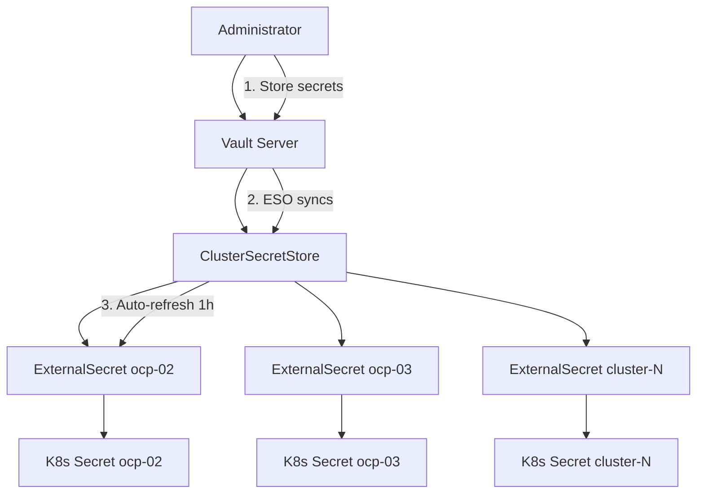

# Vault + External Secrets Operator Setup

**Audience**: Administrators  
**Complexity**: Advanced  
**Estimated Time**: 45 minutes  
**Prerequisites**: Running hub cluster, cluster-admin access

## Overview

This guide sets up HashiCorp Vault with External Secrets Operator (ESO) for centralized secret management across all managed clusters. Secrets are stored in Vault and automatically synchronized to cluster namespaces.

## Architecture



**Components:**
- **Vault**: Central secret storage with Kubernetes authentication
- **External Secrets Operator**: Syncs secrets from Vault to Kubernetes
- **ClusterSecretStore**: Global Vault connection configuration
- **ExternalSecrets**: Per-cluster secret definitions

## Installation

### Step 1: Deploy Vault and ESO

```bash
# Deploy Vault using GitOps
oc apply -f gitops-applications/global/vault.application.yaml

# Deploy External Secrets Operator
oc apply -f gitops-applications/global/eso.application.yaml

# Wait for deployments
oc wait --for=condition=available deployment/vault-0 -n vault --timeout=300s
oc wait --for=condition=available deployment/external-secrets -n external-secrets --timeout=300s
```

### Step 2: Initialize Vault

```bash
# Initialize Vault (if not already done)
oc exec vault-0 -n vault -- vault operator init -key-shares=1 -key-threshold=1

# Save the unseal key and root token securely
# Unseal Vault
oc exec vault-0 -n vault -- vault operator unseal <UNSEAL_KEY>

# Login with root token
oc exec vault-0 -n vault -- vault auth -method=token <ROOT_TOKEN>
```

### Step 3: Configure Kubernetes Authentication

```bash
# Enable Kubernetes auth method
oc exec vault-0 -n vault -- vault auth enable kubernetes

# Configure Kubernetes auth
oc exec vault-0 -n vault -- vault write auth/kubernetes/config \
    token_reviewer_jwt="$(oc get secret vault-auth-token -n vault -o jsonpath='{.data.token}' | base64 -d)" \
    kubernetes_host="$(oc config view --minify -o jsonpath='{.clusters[0].cluster.server}')" \
    kubernetes_ca_cert="$(oc get secret vault-auth-token -n vault -o jsonpath='{.data.ca\.crt}' | base64 -d)"
```

### Step 4: Setup Authentication RBAC

```bash
# Create ServiceAccount and RBAC for Vault authentication
oc apply -f vault/vault-auth-serviceaccount.yaml
```

### Step 5: Configure Secret Policies

```bash
# Create policy for cluster secrets
oc exec vault-0 -n vault -- vault policy write cluster-secrets - << 'EOF'
path "secret/data/aws-credentials" {
  capabilities = ["read"]
}
path "secret/data/pull-secret" {
  capabilities = ["read"]
}
EOF

# Create Kubernetes role
oc exec vault-0 -n vault -- vault write auth/kubernetes/role/cluster-role \
    bound_service_account_names=vault-secret-reader \
    bound_service_account_namespaces="*" \
    policies=cluster-secrets \
    ttl=1h
```

### Step 6: Deploy ClusterSecretStore

```bash
# Deploy the global ClusterSecretStore
oc apply -f vault/cluster-secret-store.yaml

# Verify ESO can connect to Vault
oc get clustersecretstore vault-cluster-store -o yaml
```

## Secret Management

### Adding Secrets to Vault

#### AWS Credentials
```bash
# Store AWS credentials in Vault
oc exec vault-0 -n vault -- vault kv put secret/aws-credentials \
    aws_access_key_id="AKIA..." \
    aws_secret_access_key="secret_key_here"
```

#### Pull Secret
```bash
# Store pull secret in Vault
oc exec vault-0 -n vault -- vault kv put secret/pull-secret \
    .dockerconfigjson="$(cat pull-secret.json)"
```

#### Custom Secrets
```bash
# Add custom application secrets
oc exec vault-0 -n vault -- vault kv put secret/database-credentials \
    username="dbuser" \
    password="secure_password"
```

### Deploying Secrets to Clusters

#### Per-Cluster Secret Deployment
```bash
# Deploy secrets for ocp-02
sed 's/CLUSTER_NAMESPACE/ocp-02/g' vault/external-secrets-template.yaml | oc apply -f -

# Deploy secrets for ocp-03
sed 's/CLUSTER_NAMESPACE/ocp-03/g' vault/external-secrets-template.yaml | oc apply -f -

# Or use a loop for all clusters
for cluster in ocp-02 ocp-03 ocp-04 eks-02 ocp-05; do
    sed "s/CLUSTER_NAMESPACE/$cluster/g" vault/external-secrets-template.yaml | oc apply -f -
done
```

#### Verify Secret Synchronization
```bash
# Check ExternalSecret status
oc get externalsecret -A

# Check synchronized Kubernetes secrets
oc get secret aws-credentials -n ocp-02
oc get secret pull-secret -n ocp-03

# Verify secret content
oc get secret aws-credentials -n ocp-02 -o yaml
```

## Operations

### Daily Operations

#### Health Checks
```bash
# Check Vault status
oc exec vault-0 -n vault -- vault status

# Check ESO status
oc get pods -n external-secrets

# Check ClusterSecretStore connectivity
oc get clustersecretstore vault-cluster-store

# Check ExternalSecret sync status
oc get externalsecret -A | grep -E "(False|Error)"
```

#### Secret Rotation
```bash
# Update AWS credentials in Vault
oc exec vault-0 -n vault -- vault kv put secret/aws-credentials \
    aws_access_key_id="new_key" \
    aws_secret_access_key="new_secret"

# Force immediate refresh (optional)
oc annotate externalsecret aws-credentials -n ocp-02 force-sync="$(date +%s)"

# Secrets automatically refresh within 1 hour
```

### Troubleshooting

#### ESO Connection Issues
```bash
# Check ESO logs
oc logs -n external-secrets deployment/external-secrets

# Check Vault connectivity from ESO pod
oc exec -n external-secrets deployment/external-secrets -- \
    curl -s http://vault.vault.svc.cluster.local:8200/v1/sys/health

# Verify ServiceAccount token
oc get secret vault-secret-reader-token -n ocp-02 -o yaml
```

#### Authentication Problems
```bash
# Test Kubernetes auth
oc exec vault-0 -n vault -- vault write auth/kubernetes/login \
    role=cluster-role \
    jwt="$(oc serviceaccounts get-token vault-secret-reader -n ocp-02)"

# Check Vault auth configuration
oc exec vault-0 -n vault -- vault read auth/kubernetes/config

# Verify role configuration
oc exec vault-0 -n vault -- vault read auth/kubernetes/role/cluster-role
```

#### Secret Sync Failures
```bash
# Check ExternalSecret events
oc describe externalsecret aws-credentials -n ocp-02

# Check ESO controller logs
oc logs -n external-secrets deployment/external-secrets -c manager

# Verify secret exists in Vault
oc exec vault-0 -n vault -- vault kv get secret/aws-credentials
```

### Backup and Recovery

#### Vault Backup
```bash
# Create Vault snapshot
oc exec vault-0 -n vault -- vault operator raft snapshot save /tmp/vault-backup.snap

# Copy backup from pod
oc cp vault/vault-0:/tmp/vault-backup.snap ./vault-backup-$(date +%Y%m%d).snap
```

#### Vault Restore
```bash
# Stop Vault
oc scale deployment vault --replicas=0 -n vault

# Copy backup to pod
oc cp ./vault-backup.snap vault/vault-0:/tmp/vault-restore.snap

# Restore from snapshot
oc exec vault-0 -n vault -- vault operator raft snapshot restore /tmp/vault-restore.snap

# Start Vault
oc scale deployment vault --replicas=1 -n vault
```

## Security Considerations

### Access Control
- **Vault Root Token**: Store securely, use only for initial setup
- **Unseal Keys**: Distribute among trusted administrators
- **ServiceAccount Tokens**: Automatically rotated by Kubernetes
- **Secret Policies**: Principle of least privilege

### Network Security
- Vault accessible only within cluster (ClusterIP service)
- TLS encryption for Vault API (configure if needed)
- Network policies to restrict ESO access

### Audit and Monitoring
```bash
# Enable Vault audit logging
oc exec vault-0 -n vault -- vault audit enable file file_path=/vault/logs/audit.log

# Monitor secret access
oc exec vault-0 -n vault -- tail -f /vault/logs/audit.log

# Set up alerts for authentication failures
# (Integration with monitoring system)
```

## Advanced Configuration

### Custom Secret Types

Create additional ExternalSecrets for custom applications:

```yaml
apiVersion: external-secrets.io/v1
kind: ExternalSecret
metadata:
  name: database-secret
  namespace: ocp-02
spec:
  refreshInterval: 30m
  secretStoreRef:
    name: vault-cluster-store
    kind: ClusterSecretStore
  target:
    name: database-secret
    creationPolicy: Owner
  data:
  - secretKey: username
    remoteRef:
      key: database-credentials
      property: username
  - secretKey: password
    remoteRef:
      key: database-credentials
      property: password
```

### Multiple Secret Stores

For different environments or security domains:

```yaml
apiVersion: external-secrets.io/v1
kind: ClusterSecretStore
metadata:
  name: vault-production-store
spec:
  provider:
    vault:
      server: "https://vault-prod.example.com:8200"
      path: "production-secrets"
      version: "v2"
      auth:
        kubernetes:
          mountPath: "kubernetes-prod"
          role: "production-role"
```

### Secret Templating

Create complex secret formats:

```yaml
apiVersion: external-secrets.io/v1
kind: ExternalSecret
metadata:
  name: application-config
  namespace: ocp-02
spec:
  target:
    name: app-config
    template:
      type: Opaque
      data:
        config.yaml: |
          database:
            host: {{ .database_host }}
            username: {{ .database_user }}
            password: {{ .database_password }}
  dataFrom:
  - extract:
      key: app-database-config
```

## Migration from Traditional Secrets

### Assessment
```bash
# Find existing secrets to migrate
oc get secrets -A | grep -E "(aws-credentials|pull-secret)"

# Export existing secret
oc get secret aws-credentials -n ocp-02 -o yaml > aws-creds-backup.yaml
```

### Migration Process
1. **Extract** existing secret values
2. **Store** in Vault using commands above
3. **Deploy** ExternalSecret resources
4. **Validate** synchronization
5. **Remove** old secrets

### Rollback Plan
```bash
# If migration fails, restore original secrets
oc apply -f aws-creds-backup.yaml

# Remove ExternalSecret resources
oc delete externalsecret aws-credentials -n ocp-02
```

## Related Documentation

- **[External Secrets Operator Documentation](https://external-secrets.io/)**
- **[HashiCorp Vault Documentation](https://www.vaultproject.io/docs)**
- **[Cluster Management Guide](./docs/operations/cluster-management.md)** - Secret management operations
- **[Command Reference](./docs/reference/commands.md)** - Vault command shortcuts
- **[Architecture Overview](./ARCHITECTURE.md)** - System architecture with Vault integration

---

*This setup provides enterprise-grade secret management with automatic synchronization, audit logging, and secure access control across all managed clusters.*